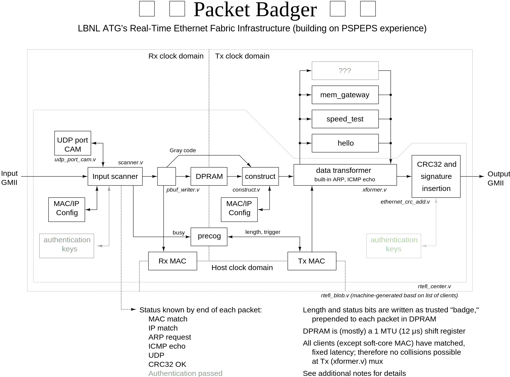
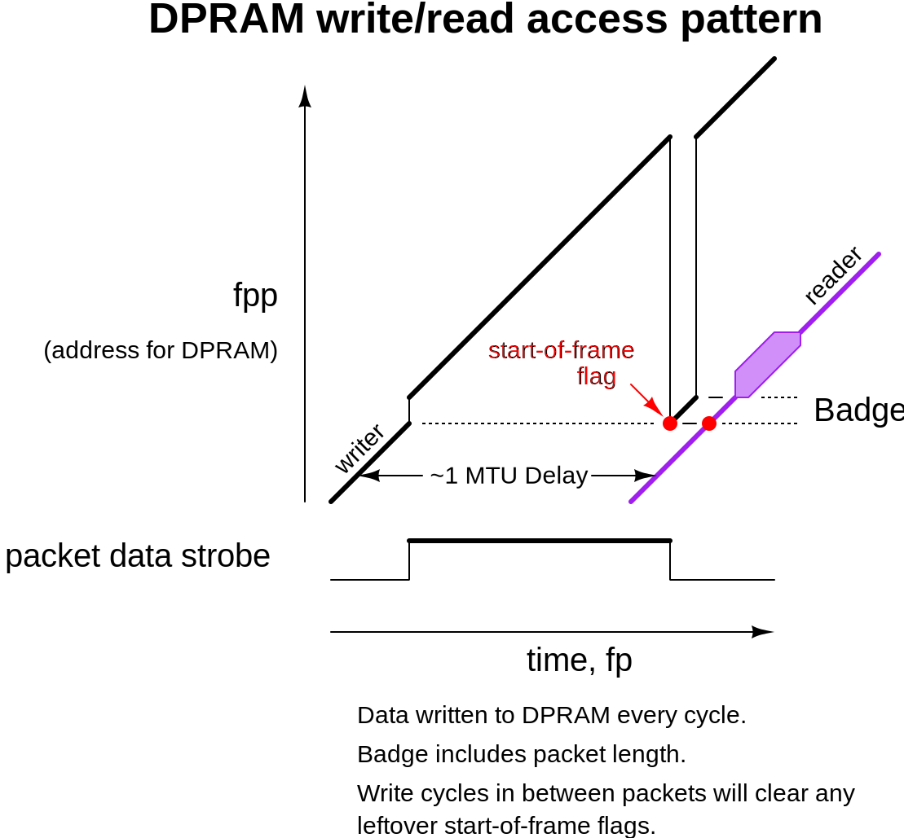
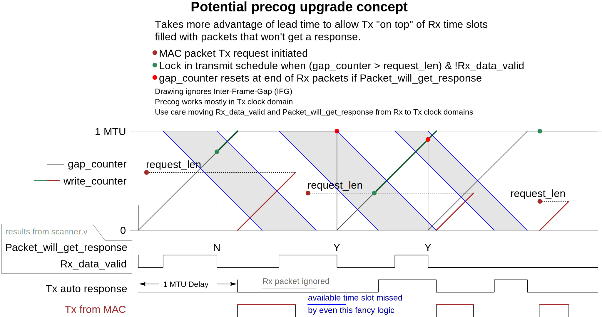

# Figures

This directory holds diagrams that document various aspects of Packet Badger.
The Verilog source code refers to these as appropriate.
Some of them are also used by the README.md in the root directory.

All the .eps files here are created and editable by [xcircuit](http://opencircuitdesign.com/xcircuit/).
Rules in the associated Makefile convert them to the web-compatible SVG format.

### Block Diagram

### Attachment of clients:

### Memory gateway (localbus) timing:

### Internal memory addressing:

### Data path in construct.v:

### Design study for a precog upgrade

