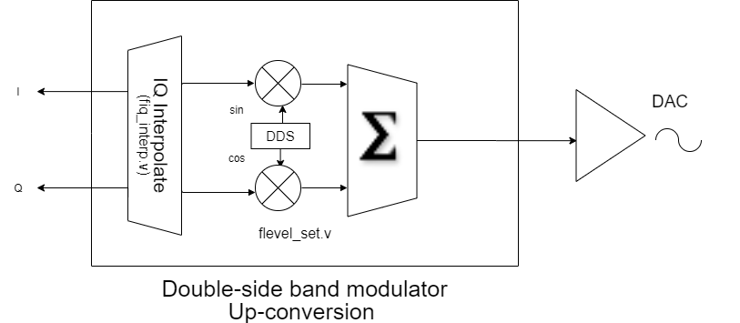

#### Digital down-conversion

The down-conversion here is different from a typical down convert module in the sense that resulting
stream of IQs are at half the data rate of the ADCs. And the low-pass filter that is applied after a typical
down-conversion to get rid of the sum frequency, in our case, is nothing but an implicit decimation filter
(hence the half data rate).

The detailed description of the mathematics behind it is written in a note by Larry Doolittle [here](http://recycle.lbl.gov/~ldoolitt/llrf/down/reconstruct.pdf).

Source code in [fdownconvert.v](https://gitlab.lbl.gov/hdl-libraries/bedrock/blob/master/dsp/fdownconvert.v). The jist is as follows:

1. Mix an Intermediate Frequency generated from a [DDS](https://gitlab.lbl.gov/hdl-libraries/bedrock/blob/master/dsp/rot_dds.v) (DDS here comes from a [CORDIC](https://gitlab.lbl.gov/hdl-libraries/bedrock/blob/master/cordic)).
2. Perform the matrix computation to extract I and Q.
3. Note that the pipeline generates one I,Q pair per 2 ADC samples. Essentially, decimating the data.
4. The IQ samples are then interleaved into a single data stream, maintaining n bits/sec IN and n bits/sec OUT.

#### IQ interpolation

Takes an interleaved IQ data stream at X samples per sec, and outputs 2 data streams I and Q at X samples per sec each. Does so by interpolating them.

[Code](https://gitlab.lbl.gov/hdl-libraries/bedrock/blob/master/dsp/fiq_interp.v)

#### Level set

Dot product of the LO signal with (I-Q) baseband data/signal. This module is used to generate the
real or imaginary components of the upconversion.

[Code](https://gitlab.lbl.gov/hdl-libraries/bedrock/blob/master/dsp/flevel_set.v)

#### Afterburner [secant interpolation]

#### SSB Out [up-conversion]

The goal here is to upconvert the feedback loop output IQ baseband stream to a DAC output stream. The IQ stream is running at half the data rate (see down-conversion above) assuming the DACs are running at the same frequency as the ADCs.

1. Input of an IQ interleaved data stream.
2. Perform IQ interpolation (described above) to bring the interleaved data stream up to regular rate.
3. Upconvert the data by multiplying the IQ datastream with LO, use level set to generate Real and Imaginary components.
4. Use afterburner.v to interpolate the mid-points of the IQ streams.

[Code](https://gitlab.lbl.gov/hdl-libraries/bedrock/blob/master/dsp/ssb_out.v)

#### DSB - Digital-sideband Modulator [up-conversion]

The goal here is to upconvert the feedback loop output IQ baseband stream to a DAC output stream. The IQ stream is running at half the data rate (see down-conversion above) assuming the DACs are running at the same frequency as the ADCs.

1. Input of an IQ interleaved data stream.
2. Perform IQ interpolation (described above) to bring the interleaved data stream up to regular rate.
3. Upconvert the data by multiplying the IQ datastream with LO, use level set to generate Real and Imaginary components and add upconverted data together.

